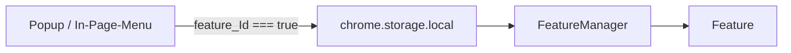

<!-- Root-README kleinanzeigen-optimal. Keine details-Klappboxen. -->

# kleinanzeigen-optimal

Chrome-Erweiterung fuer [kleinanzeigen.de](https://www.kleinanzeigen.de).

[Installation](#installation) · [Module](#module) · [Review](review.md)

---

## Worum es geht

Opt-in-Sammlung von Content-Scripts. Store-Name in `manifest.json`: Kleinanzeigen Rental Analyzer.

> [!IMPORTANT]
> Nach einer Frischinstallation ist **kein** Feature aktiv, ausser dem In-Page-Menu. Tracker-Ruleset ist im Manifest `enabled: false`. Popup, Menue und FeatureManager nutzen `KAStorage.isFeatureEnabled`.

Keine offizielle API. Layout-Aenderungen koennen Parser brechen.

---

## Installation

1. Repo klonen oder ZIP laden.
2. `chrome://extensions` — Entwicklermodus an.
3. Entpackte Erweiterung laden (Ordner mit `manifest.json`).
4. kleinanzeigen.de oeffnen, Features im Hamburger oder Popup anschalten.

> [!WARNING]
> Nach Reload der Erweiterung offene Tabs neu laden (`Extension context invalidated`).

---

## Module

Alles default **aus**.

| ID | Funktion | Hinweis |
| :--- | :--- | :--- |
| RentalAnalyzer | EUR/m2, IQR, Matrix, `rental_db` | URL-Redirect auf Miet-Suche |
| WasdNavigation | <kbd>W</kbd>/<kbd>S</kbd>/<kbd>A</kbd>/<kbd>D</kbd> | |
| UiCleaner / CleanHomepage | CSS-Ausblendungen | |
| HighResZoom | groessere CDN-Bilder | |
| SortSaver | Sortierung merken | |
| WidescreenLayout | Breite | |
| AutoShowMore | klickt Mehr anzeigen | Akamai, Pausen |
| TrackerBlocker | [`rules.json`](rules.json) | erst nach Opt-in |
| ProAdManager | gewerbliche Ads | |
| DataExport | JSONL/CSV | ToS |
| McpBridge | `ws://127.0.0.1:8765` | Token in `ka_settings.mcp_bridge_token`, Key `feature_McpBridge` |

---

## Bedienung Analyzer

Nur `/s-wohnung-mieten/`. Ampel = globale Historie, Matrix = 4-stellige PLZ.

---

## Repo

`manifest.json` bleibt im Root (Sideload). Historie unter [`archive/`](archive/). Review: [`review.md`](review.md).

## Lizenz

[MIT](LICENSE). Inoffiziell.
