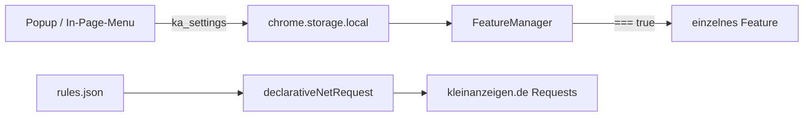

<!--
  Root-README fuer grapefruit89/kleinanzeigen-optimal
  Keine details-Klappboxen.
-->

# kleinanzeigen-optimal

<div align="center">

[](LICENSE)
[](manifest.json)
[](manifest.json)

Chrome-Erweiterung fuer [kleinanzeigen.de](https://www.kleinanzeigen.de): Mietpreis-Matrix, Tastatursteuerung, Tracker-Block, optionale Exporte.

[Installation](#installation) · [Module](#module) · [Bedienung](#bedienung) · [Review](review.md) · [Quellen](#quellen)

</div>

---

## Worum es geht

Der Store-Name in `manifest.json` lautet noch **Kleinanzeigen Rental Analyzer**. Das Repo heisst `kleinanzeigen-optimal`. Beides beschreibt dasselbe Produkt: eine **opt-in**-Sammlung von Content-Scripts, kein einzelner Analyzer.

> [!IMPORTANT]
> Nach einer Frischinstallation ist **kein** Feature aktiv, ausser dem In-Page-Menu und — abweichend — dem Tracker-Ruleset im Manifest. Alles andere schaltest du bewusst an. Das Popup luegt an dieser Stelle noch: es zeigt Haekchen, als waere alles an. Siehe [review.md](review.md).

Die Erweiterung parst das DOM der Suchseite. Sie hat **keine** offizielle Kleinanzeigen-API. Layout-Aenderungen koennen Parser und Selektoren brechen.

---

## Installation

Nur Entwicklermodus. Nicht im Chrome Web Store.

1. Repo klonen oder ZIP laden.
2. `chrome://extensions` oeffnen, **Entwicklermodus** an.
3. **Entpackte Erweiterung laden** — Ordner mit der `manifest.json` waehlen.
4. [kleinanzeigen.de](https://www.kleinanzeigen.de) oeffnen.
5. Hamburger im Header (In-Page-Menu) oder das Extension-Popup.

```text
chrome://extensions  ->  Entwicklermodus  ->  Entpackte Erweiterung laden
```

> [!WARNING]
> Nach jedem Reload der Erweiterung unter `chrome://extensions` sind bereits offene Kleinanzeigen-Tabs ungueltig (`Extension context invalidated`). Einmal die Seite neu laden.

---

## Module

Standard nach Neuinstallation: **aus**, ausser wo unten anders steht.

| ID | Was es tut | Risiko |
| :--- | :--- | :--- |
| `RentalAnalyzer` | EUR/m2, IQR-Farben, 3x3-Matrix, lokale Historie (`rental_db`, max. 2000, 90 Tage) | Hard-Redirect der Such-URL |
| `WasdNavigation` | <kbd>W</kbd>/<kbd>S</kbd> Anzeige, <kbd>A</kbd>/<kbd>D</kbd> Seite | Tastenkonflikt in Formularen |
| `UiCleaner` / `CleanHomepage` | CSS blendet Banner bzw. Startseiten-Bloecke aus | Selektoren veralten |
| `HighResZoom` | Hover laedt groessere CDN-Variante | Extra-Requests |
| `SortSaver` | merkt Sortierung | URL-Kampf mit Analyzer-Redirect |
| `WidescreenLayout` | mehr Spaltenbreite | — |
| `AutoShowMore` | klickt Mehr anzeigen | Bot-Muster (Akamai). Pausen sind Pflicht |
| `TrackerBlocker` | `declarativeNetRequest` + [`rules.json`](rules.json) | Ruleset im Manifest default an |
| `ProAdManager` | gewerbliche Anzeigen markieren/sortieren | Observer auf dem Body |
| `DataExport` | JSONL/CSV-Scraper fuer die Trefferliste | ToS, Rate-Limits |
| `McpBridge` | WebSocket `ws://localhost:8765`, schickt auf Anfrage das ganze HTML | Nur lokal, ohne Auth. Falscher Settings-Key |

`InPageMenu` ist kein Opt-in-Feature. Es haengt am Header und laeuft in einem zweiten Content-Script (`document_start`).



---

## Bedienung — Rental Analyzer

Nur auf Pfaden unter `/s-wohnung-mieten/`.

| Farbe | Bedeutung im Code |
| :--- | :--- |
| Gruen | EUR/m2 ≤ Q1 |
| Gelb | zwischen Q1 und Q3 |
| Rot | > Q3 |
| Transparent | ausserhalb von $Q1 - 1.5 × IQR$ bzw. $Q3 + 1.5 × IQR$ |

`Basis: 10/100` heisst: 10 Anzeigen auf der Seite, 100 in der lokalen Historie.

> [!CAUTION]
> Die Farbmarkierung nutzt **globale** Historie. Die Matrix-Karten sind **regional** (4-stellige PLZ). Zwei Vergleichsrahmen.

Der Analyzer erzwingt `anzeige:angebote` und `wohnung_mieten.swap_s:nein` per `location.replace`. Tausch und TOP-Ads werden ausgeblendet.

- <kbd>W</kbd> / <kbd>S</kbd> — vorherige / naechste Anzeige
- <kbd>A</kbd> / <kbd>D</kbd> — vorherige / naechste Ergebnisseite

---

## Was der Deepseek-Audit richtig gesehen hat

Struktur, leeres `docs/README.md`, kein Bundler, keine Tests, kein `.gitignore`, Root-Muell. Gueltig.

Was er nicht gesehen hat:

```diff
- groesste Schwaeche ist das Root-Verzeichnis
+ Popup default !== FeatureManager default
+ McpBridge speichert McpBridge, FeatureManager liest feature_McpBridge
+ McpBridge liefert documentElement.outerHTML an jeden lokalen WS-Client
+ TrackerBlocker default an, Rest default aus
+ GEMINI.md beschreibt lib/, der Code lebt in features/
+ icon16.png und icon48.png sind 0 Byte
+ Markierung = global, Matrix = regional
```

Reihenfolge der Arbeit: [`review.md`](review.md).

---

## Repo-Lage (Ist)

```text
kleinanzeigen-optimal/
├── manifest.json
├── rules.json
├── core/
├── features/
├── popup/
├── icons/                icon16/48 leer
├── docs/
├── scripts/
├── altes userscript.js
├── _metadata/
├── GEMINI.md
└── .mcp.json
```

---

## Mitwirken

1. Ein Feature, ein Ordner, `index.js`, Registrierung nur ueber `KAFeatureManager.register`.
2. Dieselbe Default-Logik in FeatureManager, Popup und InPageMenu.
3. Settings-Keys immer `feature_<Id>`.
4. Keine neuen MutationObserver auf `document.body` ohne Debounce.
5. HTML-Samples nicht mit Session-Daten committen.

### Schreibweise

- [Basic writing syntax](https://docs.github.com/en/get-started/writing-on-github/getting-started-with-writing-and-formatting-on-github/basic-writing-and-formatting-syntax)
- [Advanced formatting](https://docs.github.com/en/get-started/writing-on-github/working-with-advanced-formatting)
- [GFM Spec](https://github.github.com/gfm/)

**Nicht genutzt:** `<details>` / `<summary>`.

---

## Lizenz

[MIT License](LICENSE).

Inoffizielle Erweiterung. Scraping kann gegen die Nutzungsbedingungen verstossen.

---

## Quellen

1. [Chrome Extensions Manifest V3](https://developer.chrome.com/docs/extensions/mv3/intro/)
2. [declarativeNetRequest](https://developer.chrome.com/docs/extensions/reference/api/declarativeNetRequest)
3. [`docs/tracker-audit-2026-08-29.md`](docs/tracker-audit-2026-08-29.md)
4. [GitHub Basic writing syntax](https://docs.github.com/en/get-started/writing-on-github/getting-started-with-writing-and-formatting-on-github/basic-writing-and-formatting-syntax)
5. [GitHub Advanced formatting](https://docs.github.com/en/get-started/writing-on-github/working-with-advanced-formatting)
6. [GFM Spec](https://github.github.com/gfm/)
7. Deepseek-Strukturreview — Root/Docs/Tests; Sicherheit dort unvollstaendig
